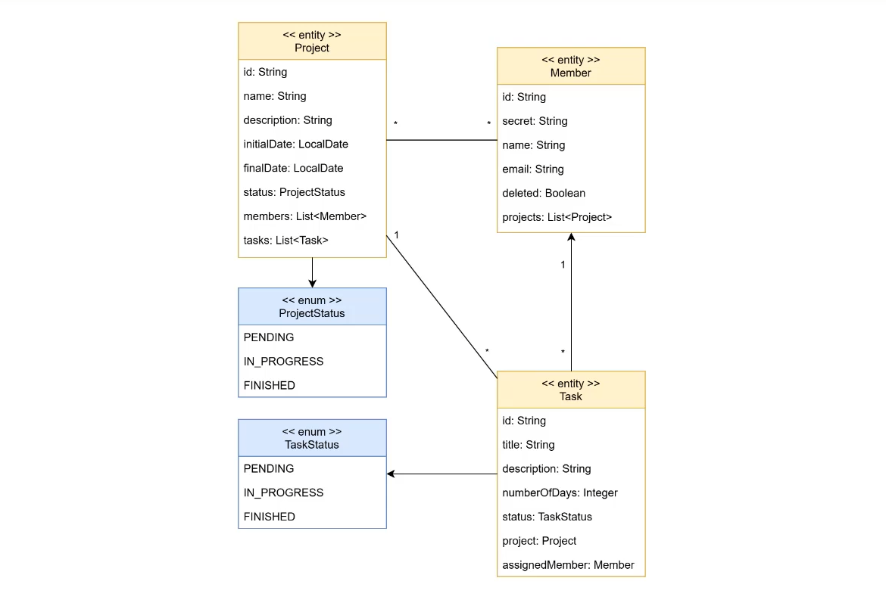

# API de Gestão Kanban

Esta API é uma solução de gestão no estilo Kanban focada em organizar projetos e simplificar tarefas. O objetivo principal do sistema é centralizar o fluxo de trabalho e melhorar a colaboração da equipe, eliminando gargalos para aumentar a produtividade.

---

## Arquitetura e Design de Software

O sistema foi desenvolvido utilizando uma arquitetura de Microsserviços, onde cada serviço possui sua própria responsabilidade e banco de dados isolado. Internamente, cada microsserviço adota uma Arquitetura em Camadas (Domínio, Aplicação e Infraestrutura), estruturada sob os princípios do DDD (Domain-Driven Design). Essa abordagem foi escolhida para garantir que as regras de negócio fiquem isoladas, organizadas e fáceis de manter à medida que o sistema evolui.

---

## Estratégia de Testes (TDD)

A estratégia de testes seguiu a metodologia **TDD (Test-Driven Development)**, onde os testes foram escritos antes do código da funcionalidade em si. Isso garantiu um código mais limpo, com alta cobertura de testes e menos propício a falhas em produção. Os testes foram implementados com as seguintes ferramentas:

- **JUnit**: Framework padrão utilizado para criar e executar os testes automatizados de forma estruturada.
- **Mockito**: Utilizado para simular o comportamento de componentes externos (como bancos de dados ou APIs de terceiros), permitindo testar o comportamento das regras de negócio de forma isolada e rápida.

---

## Automação e Deploy (CI/CD)

O processo de Integração Contínua e Entrega Contínua (CI/CD) foi configurado utilizando o **GitHub Actions**.

Com isso, sempre que um novo código é enviado para o repositório, o GitHub Actions executa automaticamente uma série de passos que incluem a validação das dependências, a compilação do código e a execução de toda a suíte de testes (TDD). Isso garante que nenhuma alteração quebre o funcionamento atual do sistema, mantendo a qualidade e a estabilidade do software de forma automatizada.

---

## Competências Utilizadas e Justificativas

- **Java 21**: Versão utilizada por trazer melhorias de desempenho e novos recursos da linguagem.
- **Spring Boot**: Utilizado para acelerar o desenvolvimento da API, pois ele automatiza as configurações iniciais e fornece uma estrutura sólida para criar aplicações prontas para produção.
- **RabbitMQ 3.13.7**: Escolhido para realizar a comunicação assíncrona entre partes do sistema. Ele gerencia filas de mensagens de forma leve, garantindo que tarefas pesadas não travem a resposta da API para o usuário.
- **Kafka**: Utilizado para o processamento de fluxos de dados em tempo real e eventos do sistema. Ele foi escolhido pela sua alta capacidade de armazenar e distribuir grandes volumes de mensagens com segurança.
- **MailTrap**: Ferramenta utilizada no ambiente de desenvolvimento para testar o envio de e-mails (como notificações de tarefas ou alertas) sem correr o risco de enviar mensagens para e-mails reais de usuários.
- **Redis**: Banco de dados em memória utilizado como camada de cache. Ele foi escolhido para armazenar dados acessados com frequência (como sessões ou configurações), reduzindo o número de consultas ao banco principal e melhorando o tempo de resposta da API.

---

## Modelo de Dados e Persistência

O sistema utiliza uma abordagem híbrida de banco de dados para aproveitar o melhor de cada tecnologia:

- **MySQL**
    - Utilizado para os dados relacionais principais da aplicação, como informações de usuários, projetos, quadros Kanban e tarefas.
    - A persistência é feita via **JPA/Hibernate**, que facilita a comunicação entre o código Java e o banco de dados relacional, transformando as tabelas em objetos de forma automatizada.

- **MongoDB**
    - Utilizado para dados não relacionais e auxiliares.
    - Sua estrutura flexível foi escolhida para armazenar registros de monitoramento, logs do sistema e histórico de alterações nas tarefas, além do controle de chaves de API (API Keys).

### Diagrama Entidade-Relacionamento (ER)

O modelo estrutural do banco de dados relacional pode ser visualizado no diagrama abaixo:



---

## Configuração do Ambiente

### Pré-requisitos
- Docker instalado na máquina
- Docker Compose instalado na máquina

### Passo 1: Configuração Inicial
Antes de iniciar a aplicação, você precisa configurar os arquivos de propriedades do Spring.
1. Vá até a pasta de configurações do projeto (em `src/main/resources`).
2. Mude o nome do arquivo `application-example.yml` para `application.yml`.

### Passo 2: Como Instalar e Rodar com Docker

O projeto já possui suporte ao Docker para facilitar a inicialização de todos os serviços necessários (bancos de dados, mensageria e cache).

1. Abra o terminal na raiz do projeto (onde está o arquivo `docker-compose.yml`).
2. Execute o comando abaixo para baixar as imagens e iniciar todos os serviços em segundo plano:
   ```bash
   docker-compose up -d
3. Para verificar se todos os containers estão rodando corretamente, execute:
    ```bash
   docker ps
4. Se precisar parar os serviços, utilize o comando:
    ```bash
   docker-compose down